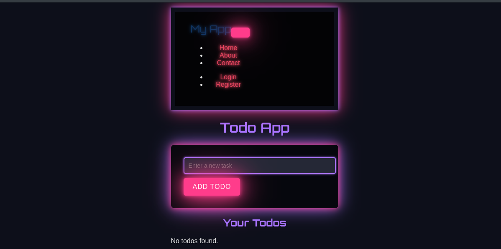
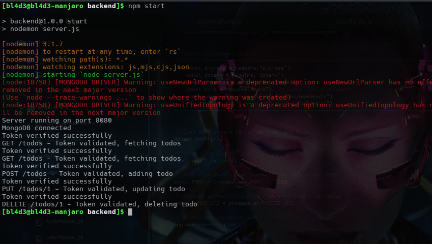
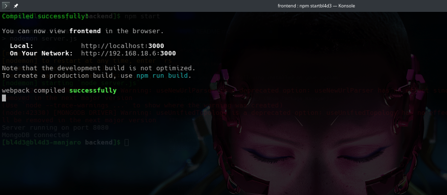
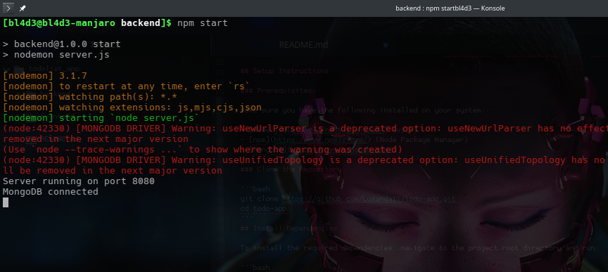

# Todo App

This is a simple **Todo App** built with React and a backend using Node.js/Express with JWT authentication. The app allows users to add, update, delete, and view a list of todos.



## Features

- **Add a Todo**: Users can create a new todo item.
- **Update a Todo**: Users can update an existing todo.
- **Delete a Todo**: Users can remove a todo from the list.
- **View Todos**: All todos are fetched from the backend and displayed in a list.
- **Authentication**: Users must be authenticated via JWT (JSON Web Token) to access the todo API.



## Technologies Used

- **Frontend**: React, Axios
- **Backend**: Node.js, Express, MongoDB (for the todo API and JWT authentication)
- **CSS**: Basic styling with custom styles in `TodoApp.css`, `TodoList.css`, and `TodoStyles.css`.

## Setup Instructions

### Prerequisites

Make sure you have the following installed on your system:

- [Node.js](https://nodejs.org/en/) (v12+)
- [npm](https://www.npmjs.com/) (Node Package Manager)
- [MongoDB](https://www.mongodb.com/)

### Clone the Repository

```bash
git clone https://github.com/Lusanda11/todo-app.git
cd todo-app
```
## Install Dependencies

To install the required dependencies, navigate to the project root directory and run:

```bash
npm install
```
## Running the application:

1. To run the frontend dependencies, navigate to the project root directory and run:

```bash
npm start
```
This will start the frontend on http://localhost:3000.



2. To run the backend dependencies, navigate to the project root directory and run:

```bash
npm start
```
This will start the backend server on http://localhost:8080.



## Usage

1. Register or login to obtain a JWT token.
2. Once logged in, you can add, update, delete, and view todos.
3. Each request (e.g., adding or updating a todo) requires the JWT token to be passed in the headers for authentication.

## API Endpoints (Backend)

| Method | Endpoint         | Description               |
|--------|------------------|---------------------------|
| GET    | /api/todos        | Get all todos             |
| POST   | /api/todos        | Add a new todo            |
| PUT    | /api/todos/:id    | Update an existing todo   |
| DELETE | /api/todos/:id    | Delete a todo             |


## License

This project is licensed under the Unlicensed.
